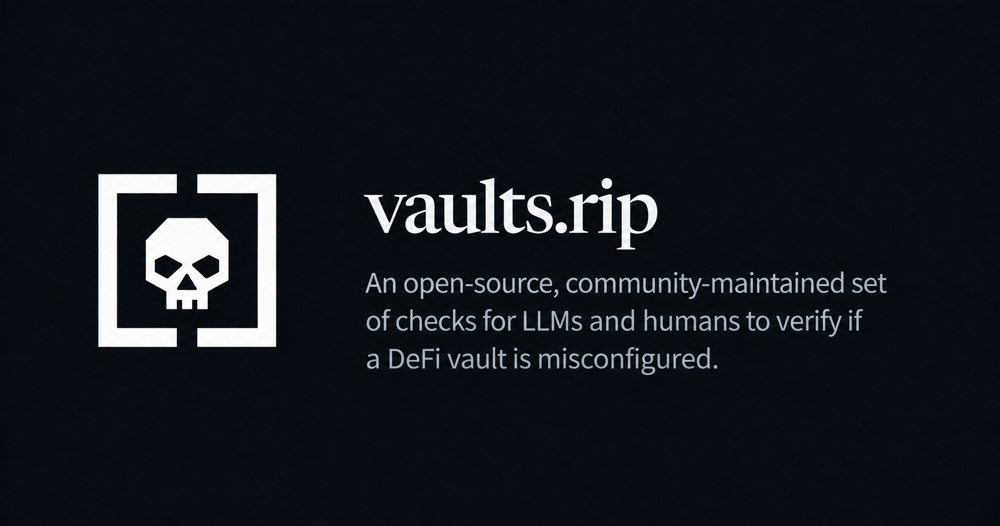

<p align="center">
  
</p>

## Why

I realised after years of depositing into vaults like Morpho and Euler, that I had a fairly surface-level understanding of the various controls curators have to direct vault capital.

The minimal design of Morpho vaults is very much optimised for security and governance minimisation, which shifts a lot of the burden to the user/curator. It's my view that, without an easy way to **verify** if a vault is secure, we are forced to **trust** the curator/protocol/whatever.

I therefore wanted to create a shortlist of checks that can be run by my LLM to verify if a vault is configured in a way that minimises my chances of losing money.

This site is a collection of those checks.

## Contributing

Contributions encouraged.

Ask your LLM to read [AGENTS.md](./AGENTS.md), or read [CONTRIBUTING.md](./CONTRIBUTING.md) yourself.

## Structure

- `/checks/` is the complete human-readable list of scanner checks, grouped by protocol and component.
- `/cases/` groups supporting research by protocol; each case links back to the checks it helps explain.
- `/llms.txt` is the canonical scanner entrypoint and report contract. It includes each supported protocol procedure and its complete check list in one document. `/SKILL.md` and `/skills.md` permanently redirect to it.
- Individual cases remain available as HTML at `/cases/<protocol>/<number>/` and plain-text Markdown at `/content/cases/<protocol>/<number>.md`.

All substantive site content is rendered from Markdown.

## Development and verification

```sh
pnpm install
pnpm dev
```

- `pnpm check` runs Astro diagnostics and content validation.
- `pnpm build` produces `dist/`.
- `pnpm verify:site` checks sources, identifiers, relationships, generated pages, orphaned files, duplicates and dead internal links in an existing build.
- `pnpm verify` runs the complete check/build/verification sequence.

Husky runs both `pnpm verify` and `pnpm verify:dev-routes` before each commit.
